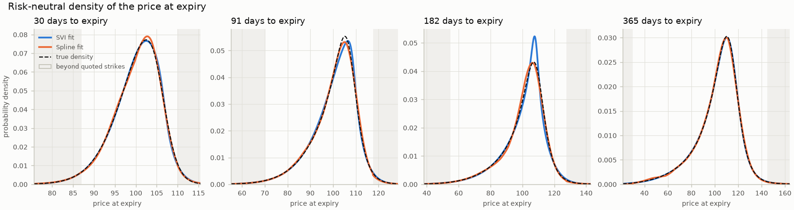
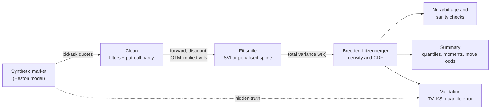

# options_density_lab

Recover the probability distribution that option prices imply for a future price, and check the recovery against a known truth.

[](https://github.com/maxskrehbiel/options_density_lab/actions/workflows/ci.yml)  

## Overview

Option prices contain the market's own probability distribution for where the underlying price will be at expiry. This project recovers that distribution from a chain of option quotes. It cleans the quotes, fits a smooth, arbitrage-free volatility smile for each expiry, and applies the Breeden-Litzenberger identity to read off the density and the cumulative distribution. Every input is generated synthetically from a model whose true distribution is known exactly, so each step can be graded against the right answer, and the demo grades itself.



## Architecture



| Stage | Modules | What happens |
|---|---|---|
| Generate | `synthetic`, `heston` | A seeded option chain with spreads, noisy mid-prices, tick rounding, zero bids, stale quotes and crossed quotes. |
| Clean | `clean` | Unusable quotes are dropped, the forward and discount factor are estimated from put-call parity, parity failures are removed, and out-of-the-money quotes are converted to implied volatility. |
| Fit | `smile` | An SVI curve or a penalised spline in total implied variance, with no-arbitrage penalties. |
| Recover | `density` | Density and CDF by finite differences of call prices, with a choice of tail model beyond the quoted strikes. |
| Check | `checks` | Butterfly, calendar, positivity, total probability, and mean equal to the forward. |
| Summarise and validate | `report`, `validate`, `plots`, `demo` | Quantiles, moments and move probabilities, plus error against the truth and the demo's pass/fail self-check. |

The recovery pipeline (`pipeline`, `clean`, `smile`, `density`, `checks`) takes any quote table and never imports the synthetic generator.

## Quickstart

```bash
git clone https://github.com/maxskrehbiel/options_density_lab.git
cd options_density_lab
python -m venv .venv
source .venv/bin/activate        # Windows: .venv\Scripts\activate
pip install -e ".[dev]"
options_density_lab demo
```

The demo writes six figures, `summary.md` and `synthetic_quotes.csv` to `./demo_output/` in a minute or two, prints its self-check against the synthetic truth, and exits with status 1 if any check fails. The committed `examples/` folder is the output of `options_density_lab demo --out examples`.

## Usage

### Command line

| Command | What it does |
|---|---|
| `options_density_lab demo [--out DIR] [--seed N] [--seeds N]` | Full synthetic demo: recovery with both smile methods, validation against the truth, a seed study over `--seeds` chains (default 10), figures, a markdown summary and a self-check. Writes to `demo_output/` by default. |
| `options_density_lab generate --out FILE [--seed N] [--exact]` | Write a synthetic chain to CSV. `--exact` removes spreads and noise (bid = ask = true price). |
| `options_density_lab recover QUOTES.csv [--method svi\|spline] [--tails smile\|exponential] [--out DIR]` | Run the pipeline on any quote CSV and write `recovery_report.md` and `densities.csv` (to `output/` by default). |

`python -m options_density_lab ...` works the same way. Logging goes to stderr at WARNING by default; `-v` shows progress (INFO) and `-vv` shows detail (DEBUG). Both flags go before the subcommand.

`recover` expects European options, one row per quote, with columns `maturity` (years), `strike`, `option_type` (`C` or `P`, any case), `bid` and `ask`. Optional columns `days` and `underlying` label the expiries and set the reference price for the move probabilities.

| Exit code | Meaning |
|---:|---|
| 0 | Success. |
| 1 | A domain check failed: an arbitrage or sanity check in `recover`, or the demo's self-check against the truth. |
| 2 | Usage, configuration or input error: bad arguments, an unreadable or empty CSV, missing columns, unknown option types, or quotes too sparse to estimate a forward. One line goes to stderr, with no traceback. |
| 3 | A required optional dependency is missing. Not used by this package, which has no optional runtime dependencies. |

### Python API

```python
import numpy as np

from options_density_lab import PipelineConfig, generate_chain, run_pipeline

chain = generate_chain(np.random.default_rng(7))
surface = run_pipeline(chain.quotes, PipelineConfig.for_method("svi"))

for expiry in surface.expiries:
    dens = expiry.density
    q05, q50, q95 = dens.quantile([0.05, 0.50, 0.95])
    print(
        f"{expiry.days:>3} days: 5%/50%/95% = {q05:.1f}/{q50:.1f}/{q95:.1f}, "
        f"P(price < 90) = {float(dens.prob_below(90.0)):.1%}"
    )

print(surface.check_table().to_string())
```

## How it works

### The terms

| Term | Meaning |
|---|---|
| Call, put | A call pays `max(S_T - K, 0)` at expiry and a put pays `max(K - S_T, 0)`, where `S_T` is the underlying price at expiry `T` (in years) and `K` is the strike. |
| Bid, ask, mid, spread | The best prices to sell and to buy, their average, and their difference. |
| Forward `F` | The price agreed today for delivery at expiry. With interest rate `r` and dividend yield `q`, $F = S_0 e^{(r-q)T}$. |
| Discount factor `D` | Today's value of 1 paid at expiry, $D = e^{-rT}$. |
| Risk-neutral distribution | The probabilities under which every option's price equals its discounted average payoff. It is the distribution option prices imply, not a forecast: it folds in what investors pay to insure against moves, so it typically puts more weight on large falls than the real-world distribution does. |
| Implied volatility | The volatility $\sigma$ that makes the Black-76 formula reproduce an observed price. Plotted against strike, it forms the smile. |
| Log-moneyness, total variance | $k = \ln(K/F)$ and $w = \sigma^2 T$. Smiles are fitted as $w(k)$. |

Black-76 (Black 1976) prices a call from these quantities:

$$C = D\left[F\,N(d_1) - K\,N(d_2)\right], \qquad d_1 = \frac{\ln(F/K) + w/2}{\sqrt{w}}, \quad d_2 = d_1 - \sqrt{w}$$

where $N$ is the standard normal cumulative distribution function.

### A synthetic market with a known answer

Prices come from the Heston (1993) model, in which volatility itself moves randomly and is negatively correlated with the price. That produces the downward-sloping smile seen in equity index options. Heston's characteristic function (the Fourier transform of the distribution) has a closed form, evaluated in the numerically stable arrangement of Albrecher et al. (2007). From it, prices (Lewis 2001), the true density (Fourier inversion) and the true CDF (Gil-Pelaez 1951) are all computed to about seven decimal places. The quotes are then degraded: spreads of 2 cents plus 3% of the price, quote centres off from fair value with a standard deviation of a quarter of the spread, tick rounding, zero bids for options worth only a cent or two, 3% stale quotes and 1% crossed quotes. The model parameters are generic textbook values, not calibrated to any market.

### Cleaning, and the forward from put-call parity

Crossed quotes (bid above ask), zero bids and very wide quotes are removed first. For European options, a call and a put at the same strike obey put-call parity:

$$C - P = D\,(F - K)$$

The right-hand side is a straight line in $K$ with slope $-D$ and intercept $DF$. A weighted line fit of (call mid minus put mid) against strike therefore recovers the discount factor and the forward from the options alone. If the fitted line falls outside a pair's bid-ask band, no price inside the quotes can satisfy parity, which is the signature of a stale quote. The worst such pair is removed and the line refit until every remaining pair is consistent. A fitted discount factor outside $(0, 1.5]$ means the quotes are inconsistent, and the expiry is rejected. At each strike only the out-of-the-money option is kept (puts below the forward, calls above), because in-the-money options are mostly intrinsic value with wide spreads. Bid, mid and ask are then converted to implied volatilities.

### A smooth, arbitrage-aware smile

Each quote is weighted by one over its squared bid-ask width, so a residual of 1 means "off by one half-spread". Two fitters are provided.

SVI (Gatheral 2004) has five parameters: $w(k) = a + b\left[\rho(k - m) + \sqrt{(k-m)^2 + s^2}\right]$. Here $a$ sets the level, $b$ the steepness of the wings, $\rho$ the tilt, $m$ the horizontal position, and $s$ how rounded the vertex is. The wings are straight lines, consistent with Lee's (2004) result that total variance can grow at most like $2|k|$.

The penalised spline (Eilers and Marx 1996) is a cubic B-spline whose roughness penalty is chosen by generalised cross-validation (Craven and Wahba 1979). It makes no shape assumption but is only trustworthy inside the quoted range.

Both fitters guard against arbitrage. The density implied by a smile is proportional to the function (Gatheral and Jacquier 2014)

$$g(k) = \left(1 - \frac{k\,w'}{2w}\right)^2 - \frac{w'^2}{4}\left(\frac{1}{w} + \frac{1}{4}\right) + \frac{w''}{2}$$

so a smile is free of butterfly arbitrage exactly when $g(k) \ge 0$. The SVI fit adds penalty terms whenever $g < 0$, whenever the wings exceed Lee's bound, and whenever total variance would fall below the previous expiry's. The spline raises its smoothing until $g \ge 0$ across the quotes. SVI's vertex rounding $s$ is bounded below by the spacing between quoted strikes: curvature finer than the quotes can resolve is not supported by the data, and it shows up as a spurious spike in the density.

### Breeden-Litzenberger: density from prices

A call's price is its discounted average payoff, $C(K) = D \int_K^\infty (s - K)\,q(s)\,ds$. Differentiating in the strike (Breeden and Litzenberger 1978):

$$P(S_T \le K) = 1 + \frac{1}{D}\frac{\partial C}{\partial K}, \qquad q(K) = \frac{1}{D}\frac{\partial^2 C}{\partial K^2}$$

The intuition is a butterfly spread: buy the $K-h$ and $K+h$ calls and sell two $K$ calls. It pays off only if the price ends near $K$, so its cost divided by $D h^2$ is the probability density there. The code prices calls from the fitted smile on a fine, evenly spaced grid and takes exactly these finite differences. The CDF comes from the first difference, so it is market-implied directly rather than by integrating the density.

### Tails beyond the quoted strikes

Quotes stop at some lowest and highest strike. The slope of the call price at those edges still pins down how much probability lies beyond each one; it does not say how that probability is spread out. Two tail models are provided. `smile` keeps SVI's own straight-line extrapolation. `exponential` replaces each tail with an exponential in log-price whose total mass and starting height match the market-implied values at the edge (rate $\lambda = f(x_R)/p_R$). The spline always uses `exponential`, because it has no principled extrapolation. Figlewski (2010) makes the same point and attaches extreme-value tails; the exponential tail here is a simpler choice with the same two matching conditions.

### No-arbitrage and sanity checks

| Check | Condition |
|---|---|
| Strike monotonicity | $-D \le \partial C/\partial K \le 0$. |
| Butterfly (convexity) | Call prices are convex in strike, or equivalently $g(k) \ge 0$. The quote check separates harmless mid-price noise from butterflies that would be tradable at the bid and ask. |
| Calendar | At the same $k$, total variance must not fall with expiry: $w(k, T_2) \ge w(k, T_1)$ for $T_2 > T_1$. |
| Distribution | Integrates to one, is non-negative, has a CDF that rises within $[0, 1]$, and has a mean equal to the forward, as every distribution under the pricing measure must. |

The tests inject a butterfly violation into clean prices, a calendar crossing, a tradable quote butterfly, and the arbitrageable SVI of Example 3.1 in Gatheral and Jacquier (2014), and check that each one is caught.

### Validation against the known truth

Because the truth is known, the recovered distribution can be scored directly. Total-variation (TV) distance, $\tfrac12\int |\hat q - q|\,dK$, is the largest disagreement in probability the two distributions can have about any event. Kolmogorov-Smirnov (KS) distance is the largest gap between the two CDFs. Selected results from [`examples/summary.md`](examples/summary.md), all on this synthetic market:

| Quotes | Method | 30 days | 91 days | 182 days | 365 days |
|---|---|---:|---:|---:|---:|
| noisy | SVI | 0.87% | 2.07% | 3.63% | 0.36% |
| noisy | spline | 1.22% | 1.33% | 2.31% | 1.22% |
| exact | SVI | 0.86% | 2.66% | 2.88% | 1.05% |
| exact | spline | 0.06% | 0.24% | 0.35% | 1.08% |
| noisy | flat-vol lognormal (reference) | 11.32% | 17.86% | 20.36% | 21.00% |

The table shows TV distance to the true density. Over 10 independently generated noisy chains, median TV is 0.8% to 1.9% for both methods.

The smile carries most of the information. A bell curve built from a single at-the-money volatility is off by 11-21%, and the fitted smiles bring that down to 0.4-3.6%.

The two fitters trade bias against noise. With exact quotes the spline error is 0.1-0.4% up to six months (1.1% at one year, where listed strikes are 5 apart), while SVI keeps an error of about 1-3% because a five-parameter curve cannot match Heston's smile exactly. With realistic noise the two converge: the spline follows the noise, and SVI's rigidity helps.

The density is a much harder target than the smile. SVI fits the 182-day smile to about 0.2 volatility points, inside the bid-ask spread, yet places a visible spike near the peak of the density. The density is a second derivative, so small, smooth smile errors are strongly amplified.

Tail mass is market-implied; tail shape is not. The recovered probability beyond the quoted strikes matches the truth closely (for example 2.29% against 2.27% below the lowest 30-day strike). The error from beyond the quoted range is small because that mass is small, not because the tail shape was identified.

## Project layout

```
options_density_lab/
├── .github/workflows/ci.yml      lint, format, type check, tests, demo and reproducibility diff
├── src/options_density_lab/
│   ├── __init__.py               public API and version
│   ├── __main__.py               python -m options_density_lab
│   ├── cli.py                    demo, generate and recover subcommands
│   ├── errors.py                 exception types for bad input
│   ├── _types.py                 array type aliases
│   ├── black76.py                Black-76 prices, vega, implied volatility
│   ├── heston.py                 Heston characteristic function, prices, true density and CDF
│   ├── synthetic.py              seeded synthetic chains with quote defects
│   ├── clean.py                  filters, put-call parity forward and discount, OTM implied vols
│   ├── smile.py                  SVI and penalised-spline smiles with no-arbitrage penalties
│   ├── density.py                Breeden-Litzenberger density, CDF and tail models
│   ├── checks.py                 butterfly, calendar and distribution checks
│   ├── pipeline.py               input validation, then clean, fit, recover and check per expiry
│   ├── validate.py               error metrics against the known truth
│   ├── report.py                 summaries and markdown tables
│   ├── plots.py                  figures
│   └── demo.py                   the end-to-end demo and its self-check
├── tests/                        a test module for each module above except __init__, __main__,
│                                 errors and _types, plus shared fixtures in conftest.py
├── examples/                     committed demo output: figures, summary.md, synthetic_quotes.csv
├── pyproject.toml
└── LICENSE
```

## Development

```bash
pip install -e ".[dev]"
ruff check .
ruff format --check .
mypy src
pytest --cov=options_density_lab --cov-report=term-missing
options_density_lab demo
```

The tests check behaviour against known answers: Black-Scholes limits, exact SVI parameter recovery, analytic gradients against finite differences, injected arbitrage, input validation, and recovery error against the Heston truth. CI runs the same commands on Python 3.11 and 3.12, then regenerates `examples/` with `options_density_lab demo --out examples` and fails if any committed text file changes. Figures are excluded from that comparison.

## Data

All data in this repository is synthetic. `examples/synthetic_quotes.csv` and every figure are generated by `options_density_lab demo --out examples` from a seeded Heston model with illustrative parameters (spot 100, rate 4%, dividend yield 1.5%). No market data, vendor data or third-party datasets are used or needed. The methods are standard published techniques, listed under References.

## Limitations

- Validation is synthetic only. Real quotes add problems not simulated here: American early exercise (single-stock options), discrete dividends, asynchronous quote times and erroneous prints.
- The pipeline assumes European options. American options would need their early-exercise premium removed first.
- Accuracy is measured against one model family, Heston. Smiles with jumps or event-driven kinks (for example a W shape before an earnings date) may favour different methods.
- Only the tail mass beyond the quoted strikes is market-implied; the tail shape is an assumption.
- Expiries are fitted one at a time. Only the SVI calendar penalty links them, and there is no interpolation between expiries.
- Each density is a point estimate without error bands. Resampling the quotes within their spreads would give them.
- Short-dated discount factors are imprecise. Parity pins down the forward well, but for a 30-day expiry the implied rate can be off by a couple of percentage points (6.2% against a true 4.0% in the demo), with negligible effect on the density.
- The recovered probabilities are risk-neutral: they describe prices, not forecasts.

## References

- Albrecher, H., Mayer, P., Schoutens, W., and Tistaert, J. (2007). The little Heston trap. *Wilmott Magazine*, January 2007, 83-92.
- Black, F. (1976). The pricing of commodity contracts. *Journal of Financial Economics*, 3(1-2), 167-179.
- Breeden, D. T., and Litzenberger, R. H. (1978). Prices of state-contingent claims implicit in option prices. *Journal of Business*, 51(4), 621-651.
- Craven, P., and Wahba, G. (1979). Smoothing noisy data with spline functions: Estimating the correct degree of smoothing by the method of generalized cross-validation. *Numerische Mathematik*, 31(4), 377-403.
- Eilers, P. H. C., and Marx, B. D. (1996). Flexible smoothing with B-splines and penalties. *Statistical Science*, 11(2), 89-121.
- Figlewski, S. (2010). Estimating the implied risk-neutral density for the U.S. market portfolio. In T. Bollerslev, J. Russell and M. Watson (eds.), *Volatility and Time Series Econometrics: Essays in Honor of Robert F. Engle*, 323-353. Oxford University Press.
- Gatheral, J. (2004). A parsimonious arbitrage-free implied volatility parameterization with application to the valuation of volatility derivatives. Presentation at Global Derivatives and Risk Management, Madrid.
- Gatheral, J., and Jacquier, A. (2014). Arbitrage-free SVI volatility surfaces. *Quantitative Finance*, 14(1), 59-71.
- Gil-Pelaez, J. (1951). Note on the inversion theorem. *Biometrika*, 38(3-4), 481-482.
- Heston, S. L. (1993). A closed-form solution for options with stochastic volatility with applications to bond and currency options. *Review of Financial Studies*, 6(2), 327-343.
- Lee, R. W. (2004). The moment formula for implied volatility at extreme strikes. *Mathematical Finance*, 14(3), 469-480.
- Lewis, A. L. (2001). A simple option formula for general jump-diffusion and other exponential Lévy processes. Working paper, SSRN 282110.

## License

MIT © Maxwell Krehbiel. See [LICENSE](LICENSE).
