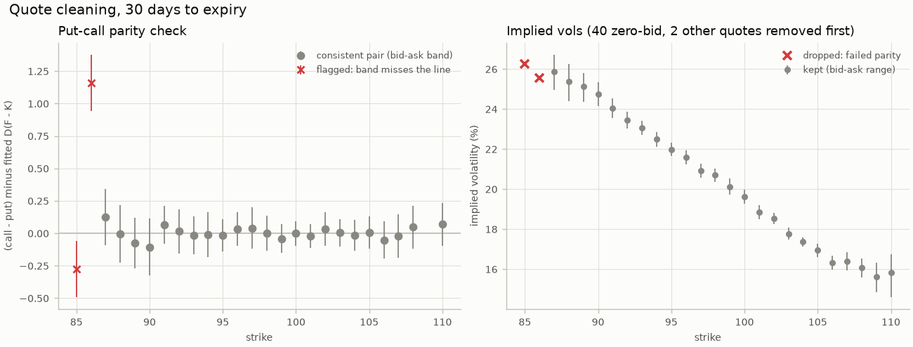
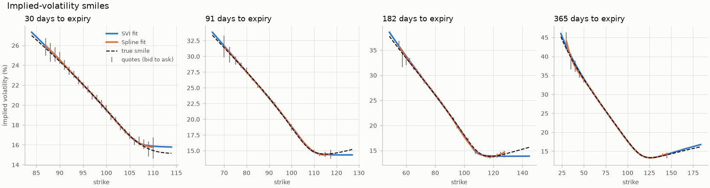
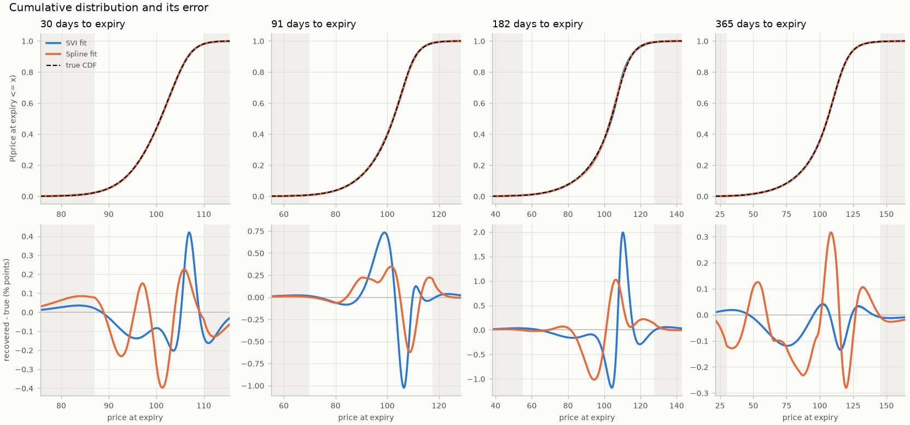
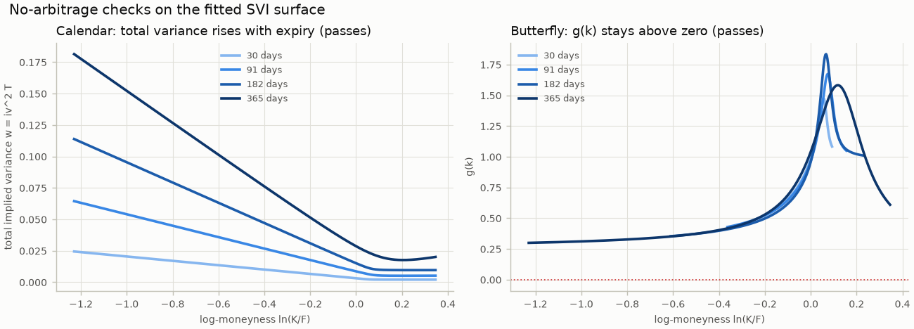
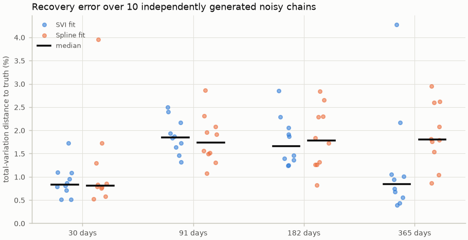

# Demo summary

Everything below comes from **synthetic** option quotes generated by this package (seed 7). No market data is used. The generating model is Heston with v0=0.04, kappa=1.5, theta=0.04, sigma=0.6, rho=-0.7; spot 100, rate 4.0%, dividend yield 1.5%. These are illustrative values, not calibrated to any market.

The chain has 460 quotes across 4 expiries, of which 12 were made stale and 2 crossed on purpose.

## 1. Cleaning

| days | quotes | zero_bid | crossed | wide | parity | otm_fitted | outliers | forward | discount |
|---:|---:|---:|---:|---:|---:|---:|---:|---:|---:|
| 30 | 134 | 40 | 1 | 1 | 2 | 24 | 0 | 100.217 | 0.99494 |
| 91 | 92 | 23 | 1 | 3 | 0 | 20 | 0 | 100.608 | 0.98720 |
| 182 | 134 | 35 | 0 | 2 | 0 | 30 | 0 | 101.268 | 0.98232 |
| 365 | 100 | 25 | 0 | 1 | 0 | 24 | 0 | 102.572 | 0.96274 |

## 2. Smiles

## 3. Recovered distribution (SVI, noisy quotes)

Quantiles as % moves from the current price, and the distribution's volatility and shape:

| days | implied_rate_pct | vol_pct | skew | excess_kurt | q05_move_pct | q25_move_pct | q50_move_pct | q75_move_pct | q95_move_pct |
|---:|---:|---:|---:|---:|---:|---:|---:|---:|---:|
| 30 | 6.17 | 20.21 | -0.90 | 1.55 | -10.10 | -3.10 | 0.91 | 4.23 | 8.12 |
| 91 | 5.17 | 20.56 | -1.44 | 3.79 | -17.72 | -4.50 | 2.34 | 7.25 | 13.23 |
| 182 | 3.58 | 20.80 | -1.91 | 6.41 | -24.53 | -4.89 | 4.13 | 9.37 | 18.55 |
| 365 | 3.80 | 21.31 | -2.13 | 7.83 | -33.16 | -6.22 | 5.84 | 14.42 | 26.40 |

Probability of a move of at least the stated size by expiry:

| days | p_down_5 | p_up_5 | p_down_10 | p_up_10 | p_down_20 | p_up_20 |
|---:|---:|---:|---:|---:|---:|---:|
| 30 | 16.9% | 19.6% | 5.1% | 2.0% | 0.3% | 0.0% |
| 91 | 23.7% | 36.9% | 13.3% | 12.4% | 3.7% | 0.6% |
| 182 | 24.8% | 46.4% | 16.8% | 22.3% | 7.4% | 3.8% |
| 365 | 26.8% | 52.3% | 20.1% | 37.9% | 11.2% | 12.5% |

## 4. No-arbitrage and sanity checks (SVI, noisy quotes)

| days | check | passed |
|:---|:---|:---|
| 30 | quoted butterflies | pass |
| 30 | smile butterfly | pass |
| 30 | integrates to one | pass |
| 30 | non-negative density | pass |
| 30 | CDF monotone in [0, 1] | pass |
| 30 | mean equals forward | pass |
| 91 | quoted butterflies | pass |
| 91 | smile butterfly | pass |
| 91 | integrates to one | pass |
| 91 | non-negative density | pass |
| 91 | CDF monotone in [0, 1] | pass |
| 91 | mean equals forward | pass |
| 182 | quoted butterflies | pass |
| 182 | smile butterfly | pass |
| 182 | integrates to one | pass |
| 182 | non-negative density | pass |
| 182 | CDF monotone in [0, 1] | pass |
| 182 | mean equals forward | pass |
| 365 | quoted butterflies | pass |
| 365 | smile butterfly | pass |
| 365 | integrates to one | pass |
| 365 | non-negative density | pass |
| 365 | CDF monotone in [0, 1] | pass |
| 365 | mean equals forward | pass |
| all | calendar | pass |

## 5. Self-check against the known truth

| check | result | limit |
|:---|:---|:---|
| arbitrage and sanity checks, svi | pass | every check passes |
| arbitrage and sanity checks, spline | pass | every check passes |
| density error, noisy quotes | pass | below 5.0% |
| CDF error, noisy quotes | pass | below 2.5% |
| spline density error, exact quotes | pass | below 1.5% |
| forward from put-call parity | pass | below 5 bp |
| fitted smile beats flat-vol baseline | pass | at least 3x |

## 6. Validation against the known truth

Metric definitions:

- `tv`: total-variation distance: the largest disagreement in probability about any event
- `tv_tails`: part of tv from beyond the quoted strikes (extrapolation, not data)
- `ks`: largest gap between the recovered and true CDFs
- `q_err_max_pct`: worst error across the 1%-99% quantiles, in % of the forward
- `iv_rmse_volpts`: root-mean-square smile error at the quoted strikes, in vol points

`exact` quotes have no spread or noise (bid = ask = true price); `noisy` are the realistic quotes above. The gap between the two rows for a method is the cost of market noise; the exact row is the method's own approximation error. The `lognormal` rows are a reference point, not a method: the bell curve implied by a single at-the-money volatility, which ignores the smile.

| quotes | method | days | TV distance | TV from tails | KS distance | worst quantile error | smile RMSE (vol pts) |
|:---|:---|---:|---:|---:|---:|---:|---:|
| noisy | svi | 30 | 0.87% | 0.12% | 0.42% | 0.28% | 0.139 |
| noisy | svi | 91 | 2.07% | 0.06% | 1.02% | 0.19% | 0.123 |
| noisy | svi | 182 | 3.63% | 0.08% | 1.99% | 0.44% | 0.226 |
| noisy | svi | 365 | 0.36% | 0.02% | 0.13% | 0.29% | 0.182 |
| noisy | spline | 30 | 1.22% | 0.16% | 0.40% | 0.28% | 0.130 |
| noisy | spline | 91 | 1.33% | 0.12% | 0.62% | 0.50% | 0.085 |
| noisy | spline | 182 | 2.31% | 0.09% | 1.03% | 0.82% | 0.185 |
| noisy | spline | 365 | 1.22% | 0.08% | 0.32% | 0.48% | 0.431 |
| exact | svi | 30 | 0.86% | 0.03% | 0.36% | 0.05% | 0.054 |
| exact | svi | 91 | 2.66% | 0.03% | 1.27% | 0.22% | 0.129 |
| exact | svi | 182 | 2.88% | 0.01% | 1.41% | 0.33% | 0.119 |
| exact | svi | 365 | 1.05% | 0.00% | 0.50% | 0.23% | 0.060 |
| exact | spline | 30 | 0.06% | 0.03% | 0.03% | 0.00% | 0.000 |
| exact | spline | 91 | 0.24% | 0.01% | 0.05% | 0.01% | 0.001 |
| exact | spline | 182 | 0.35% | 0.00% | 0.12% | 0.02% | 0.002 |
| exact | spline | 365 | 1.08% | 0.00% | 0.38% | 0.10% | 0.013 |
| noisy | lognormal | 30 | 11.32% | 2.12% | 6.00% | 3.66% | 3.420 |
| noisy | lognormal | 91 | 17.86% | 1.85% | 10.03% | 9.53% | 6.614 |
| noisy | lognormal | 182 | 20.36% | 1.22% | 11.59% | 16.19% | 8.790 |
| noisy | lognormal | 365 | 21.00% | 0.71% | 11.84% | 22.50% | 11.473 |

Recovered versus true quantiles, skew and market-implied tail mass (SVI, noisy):

| days | q05_hat | q05_true | q50_hat | q50_true | q95_hat | q95_true | skew_log_hat | skew_log_true | tail_left_hat | tail_left_true | tail_right_hat | tail_right_true |
|---:|---:|---:|---:|---:|---:|---:|---:|---:|---:|---:|---:|---:|
| 30 | 89.90 | 89.88 | 100.91 | 100.89 | 108.12 | 108.20 | -0.896 | -0.874 | 2.29% | 2.27% | 1.98% | 1.85% |
| 91 | 82.28 | 82.16 | 102.34 | 102.39 | 113.23 | 113.24 | -1.441 | -1.425 | 0.84% | 0.83% | 1.41% | 1.39% |
| 182 | 75.47 | 75.21 | 104.13 | 103.83 | 118.55 | 118.28 | -1.906 | -1.814 | 0.64% | 0.61% | 0.82% | 0.80% |
| 365 | 66.84 | 66.54 | 105.84 | 105.85 | 126.40 | 126.43 | -2.126 | -2.090 | 0.21% | 0.19% | 0.43% | 0.42% |

## 7. Seed study (10 independent noisy chains)

| method | days | median TV | 90th pct TV | median KS | 90th pct KS |
|:---|---:|---:|---:|---:|---:|
| spline | 30 | 0.81% | 1.95% | 0.42% | 0.64% |
| spline | 91 | 1.74% | 2.36% | 0.64% | 0.85% |
| spline | 182 | 1.78% | 2.67% | 0.58% | 1.00% |
| spline | 365 | 1.80% | 2.66% | 0.79% | 1.29% |
| svi | 30 | 0.84% | 1.16% | 0.33% | 0.49% |
| svi | 91 | 1.85% | 2.40% | 0.65% | 0.98% |
| svi | 182 | 1.67% | 2.35% | 0.65% | 0.97% |
| svi | 365 | 0.84% | 2.38% | 0.51% | 1.30% |
